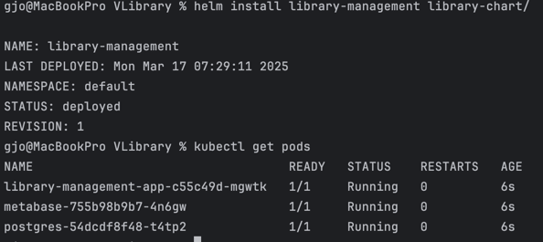
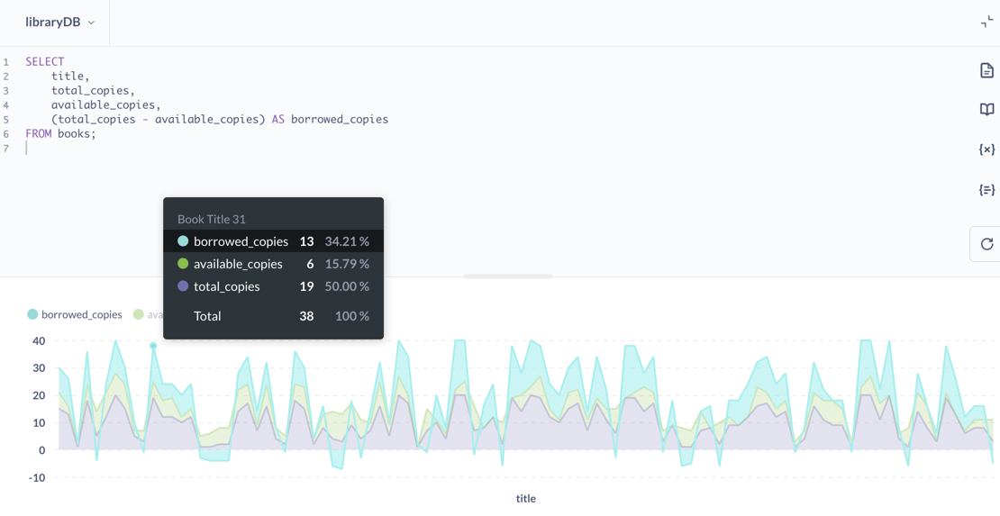
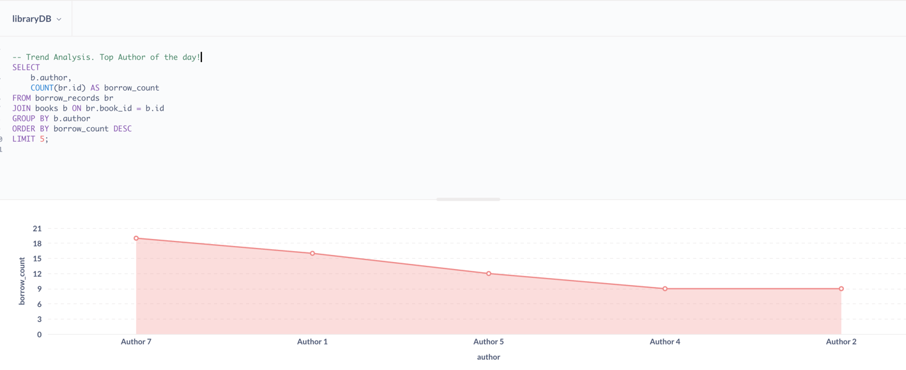

# Library Management System API

This project is a **Library Management System** jpp built using **Spring Boot**, **java 21**, and **Flyway** for database migrations.  
It provides an authentication system where **owners** can **add and delete books**, while **clients** can **view, borrow, and return books**.

This project also includes visualization using Metabase, an open-source business intelligence tool that allows easy data exploration and analysis. Metabase provides an intuitive interface for generating dashboards, charts, and reports without requiring deep SQL knowledge.  
Metabase is used in this project to analyze various library-related trends, such as book borrowing patterns, popular authors, and overdue books. The goal is to provide insights into library usage and improve decision-making.


##  API Endpoints and cURL Commands

### 1. Add a Book
####  **Only Owners can add books**
```sh
curl -u owner:owner123 -X POST http://localhost:8080/api/books/add -H "Content-Type: application/json" -d '{
"title": "Book1",
"author": "Author1",
"totalCopies": 5,
"availableCopies":5
}'
```

####  **Clients are not allowed to add books**
```sh
curl -u client:client123 -X POST http://localhost:8080/api/books/add -H "Content-Type: application/json" -d '{
"title": "Book1",
"author": "Author1",
"totalCopies": 5,
"availableCopies":5
}'
```

####  **Add multiple books using a loop**
```sh
for i in {1..10}; do
curl -u owner:owner123 -X POST http://localhost:8080/api/books/add \
-H "Content-Type: application/json" \
-d "{
\"title\": \"Book Title $i\",
\"author\": \"Author $i\",
\"totalCopies\": $i,
\"availableCopies\": $i
}"
echo ""
done
```

---

## 2.  View Books

####  **Clients can view available books**
```sh
curl -u client:client123 -X GET http://localhost:8080/api/books
```

####  **Owners can view all books**
```sh
curl -u owner:owner123 -X GET http://localhost:8080/api/books
```

---

## 3.  Borrow a Book
#### **Clients can borrow books**
```sh
curl -u client:client123 -X POST http://localhost:8080/api/books/borrow/1
```

####  **Owners cannot borrow books**
```sh
curl -u owner:owner123 -X POST http://localhost:8080/api/books/borrow/1  #  Not allowed
```

---

## 4. Return a Book
####  **Clients can return borrowed books**
```sh
curl -u client:client123 -X POST http://localhost:8080/api/books/return/1
```

####  **Owners cannot return books**
```sh
curl -u owner:owner123 -X POST http://localhost:8080/api/books/return/1  # Not allowed
```

---

## 5.  Delete a Book
####  **Clients cannot delete books**
```sh
curl -u client:client123 -X DELETE http://localhost:8080/api/books/delete/1  #  Not allowed
```

#### **Only Owners can delete books**
```sh
curl -u owner:owner123 -X DELETE http://localhost:8080/api/books/delete/1
```

## 6.  How to Run the Library Management Application?

###  A) Using Docker Compose
To run the application with **Docker Compose**, follow these steps:

```sh
mvn spring-boot:run
```

Optional - After starting the application, run the following command  to create the database for Metabase (visualization part):

```sh
docker exec -it library-db psql -U postgres -c "CREATE DATABASE metabase_db;"
```

---

###  B) Using Helm Chart (Alternate way)
To deploy the application using **Helm**, follow these steps:

###  **Install the Helm Chart**
```sh
helm install library-management library-chart/
```

###  **Uninstall the Helm Chart**
```sh
helm uninstall library-management
```

###  **Port Forwarding**
Before using `curl` to interact with the application, **expose the application and Metabase services**:

####  **Application (Library Management)**
```sh
kubectl port-forward svc/library-management-app 8080:8080
```

####  **Metabase (Visualization)**
```sh
kubectl port-forward svc/metabase 3000:3000
```

###  **Create Metabase Database**
Run the following command inside the **PostgreSQL pod** to create a database for Metabase:

```sh
kubectl exec -it $(kubectl get pod -l app=postgres -o jsonpath="{.items[0].metadata.name}") -- \
psql -U postgres -c "CREATE DATABASE metabase_db;"
```

---

## 7.  Visualisation/TrendAnalysis using Apache Metabase



